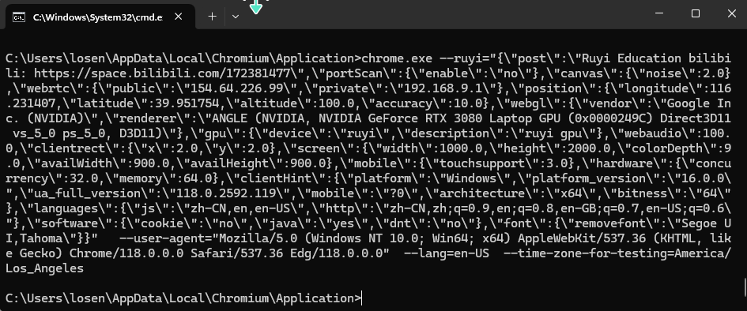

  

# 简介
如意指纹浏览器是基于 [Chromium](https://dev.chromium.org) 119版本的指纹浏览器，运行在win11平台，可以完美通过BrowserScan的检测。

该指纹浏览器指纹根据如意教育 [课程](https://space.bilibili.com/172381477) 开发而来。使用指纹传递的方式进行浏览器指纹定制，基于BrowserScan指纹检测网站，对其中的每一个指纹都进行了定制修改，能够通过网站检测。

如意指纹浏览器说明：

1. 下载mini_installer后进行安装，桌面会出现Chromium浏览器图标。
2. 可以在CMD命令行中传递参数启动。
3. 支持使用自动化测试工具，比如playwright启动。

# 准备工作
首先，从[发布页面]() 下载最新的 mini_installer.exe 安装包,双击后将其安装到PC上。

## 创建指纹浏览器环境
1. 打开 Chromium 所在目录，并使用cmd命令行工具启动，在--ruyi中传递各类指纹参数即可。

2. 要想隔离不同参数的指纹浏览器，需要为不同浏览器分配用户目录，使用--user-data-dir="xxx"。

# 亲测可用的指纹修改
可以使用 [BrowserScan](https://www.browserscan.net/)<td>😄</td> 和 [browserleaks](https://browserleaks.com/) 来测试效果。
- 指纹参数汇总：需要携带参数中的post，否则不起作用
  - chrome.exe --ruyi="{\"post\":\"Ruyi Education bilibili: https://space.bilibili.com/172381477\",\"portScan\":{\"enable\":\"no\"},\"canvas\":{\"noise\":2.0},\"webrtc\":{\"public\":\"154.64.226.99\",\"private\":\"192.168.9.1\"},\"position\":{\"longitude\":116.231407,\"latitude\":39.951754,\"altitude\":100.0,\"accuracy\":10.0},\"webgl\":{\"vendor\":\"Google Inc. (NVIDIA)\",\"renderer\":\"ANGLE (NVIDIA, NVIDIA GeForce RTX 3080 Laptop GPU (0x0000249C) Direct3D11 vs_5_0 ps_5_0, D3D11)\"},\"gpu\":{\"device\":\"ruyi\",\"description\":\"ruyi gpu\"},\"webaudio\":100.0,\"clientrect\":{\"x\":2.0,\"y\":2.0},\"screen\":{\"width\":1000.0,\"height\":2000.0,\"colorDepth\":9.0,\"availWidth\":900.0,\"availHeight\":900.0},\"mobile\":{\"touchsupport\":3.0},\"hardware\":{\"concurrency\":16.0,\"memory\":64.0},\"clientHint\":{\"platform\":\"Windows\",\"platform_version\":\"16.0.0\",\"ua_full_version\":\"118.0.2592.119\",\"mobile\":\"?0\",\"architecture\":\"x64\",\"bitness\":\"64\"},\"languages\":{\"js\":\"zh-CN,en,en-US\",\"http\":\"zh-CN,zh;q=0.9,en;q=0.8,en-GB;q=0.7,en-US;q=0.6\"},\"software\":{\"cookie\":\"no\",\"java\":\"yes\",\"dnt\":\"no\"},\"font\":{\"removefont\":\"Segoe UI,Tahoma\"}}"   --user-agent="Mozilla/5.0 (Windows NT 10.0; Win64; x64) AppleWebKit/537.36 (KHTML, like Gecko) Chrome/118.0.0.0 Safari/537.36 Edg/118.0.0.0"  --lang=en-US  --time-zone-for-testing=America/Los_Angeles  --user-data-dir="C:/user2"

- [x] WebRTC内外网指纹
  - \"webrtc\":{\"public\":\"154.64.226.99\",\"private\":\"192.168.9.1\"}
- [x] 地理位置信息
  - \"position\":{\"longitude\":116.231407,\"latitude\":39.951754,\"altitude\":100.0,\"accuracy\":10.0}
- [x] canvas指纹：修改canvas图像指纹
  - \"canvas\":{\"noise\":2.0}
- [x] webgl指纹
  - \"webgl\":{\"vendor\":\"Google Inc. (NVIDIA)\",\"renderer\":\"ANGLE (NVIDIA, NVIDIA GeForce RTX 3080 Laptop GPU (0x0000249C) Direct3D11 vs_5_0 ps_5_0, D3D11)\"}
- [x] webAudio：为audio增加噪声
  - \"webaudio\":100.0,
- [x] Client Rect：字体位置
  - \"clientrect\":{\"x\":2.0,\"y\":2.0}
- [x] webGPU：要存在真实GPU，否则会被检测
  - \"gpu\":{\"device\":\"ruyi\",\"description\":\"ruyi gpu\"}
  - 关闭状态可使用--enable-unsafe-webgpu开启
- [x] Screen：屏幕分辨率
  - \"screen\":{\"width\":1000.0,\"height\":2000.0,\"colorDepth\":9.0,\"availWidth\":900.0,\"availHeight\":900.0},
- [x] Touch Support：是否支持触摸，指定触摸点
  - \"mobile\":{\"touchsupport\":3.0}
- [x] 处理器和内存大小
  - \"hardware\":{\"concurrency\":16.0,\"memory\":64.0}
- [x] Browser/UA/Client Hints：对应BrowserScan的Browser指纹
  - --user-agent="Mozilla/5.0 (Windows NT 10.0; Win64; x64) AppleWebKit/537.36 (KHTML, like Gecko) Chrome/118.0.0.0 Safari/537.36 Edg/118.0.0.0" 
  - \"clientHint\":{\"platform\":\"Windows\",\"platform_version\":\"16.0.0\",\"ua_full_version\":\"118.0.2592.119\",\"mobile\":\"?0\",\"architecture\":\"x64\",\"bitness\":\"64\"}
- [x] 时区和时间
  -  --time-zone-for-testing=America/Los_Angeles
- [x] 语言：包括JS层的和HTTP层的语言
  - "languages\":{\"js\":\"zh-CN,en,en-US\",\"http\":\"zh-CN,zh;q=0.9,en;q=0.8,en-GB;q=0.7,en-US;q=0.6\"}
  - --lang=en-US：系统界面语言
- [x] [CDP检测](https://www.browserscan.net/bot-detection)<td>😄</td>
  - 已内置去除
- [x] 一些开关：cookie、java和DNT的开关，no为关闭，yes为开启
  - \"software\":{\"cookie\":\"no\",\"java\":\"yes\",\"dnt\":\"no\"}
- [x] 端口扫描开关
  - \"portScan\":{\"enable\":\"no\"}
- [x] 字体指纹去除：把要去除的字体以,分开
  - \"font\":{\"removefont\":\"Segoe UI,Tahoma\"}"

# 自动化
如意指纹浏览器基于Chromium开发，可以使用playwright或者其他任意自动化工具驱动。 

# 免责声明
本免责声明旨在明确指出，本项目为课程教学产品，不得将本项目技术用于任何非法目的或破坏行为。作者对于任何使用本项目对他人或系统造成的损害概不负责。

# 联系我
- b站[如意教育](https://space.bilibili.com/172381477)。
- vx: `Charleval`
- 课程《从零开发Chromium指纹浏览器》<td>😄</td>：教学员从零开发一个指纹浏览器
- 课程《Chromium指纹浏览器过检测专题》<td>😄</td>：专门用于分析各个浏览器指纹检测网站，从源码上完美过检测。
- 如意教育，提供专业指纹浏览器开发教学服务，一对一答疑。

